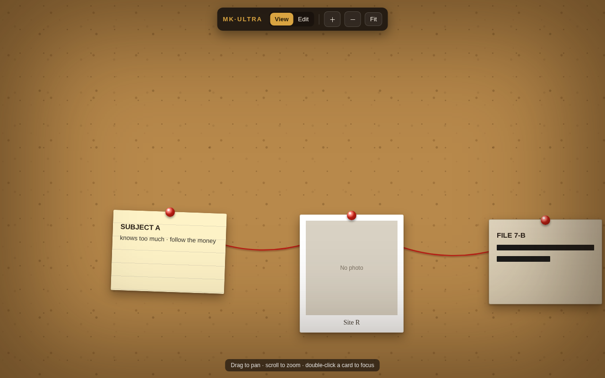

# MK·ULTRA — Conspiracy-Corkboard Mindmap Visualizer

An interactive detective-style corkboard: pinned cards (index notes, polaroid
photos, redacted documents) connected by red yarn strings. Pan freely, zoom with
the wheel, double-click any card to focus it. A **View / Edit** toggle switches
between a read-only board and full authoring.



## Stack

- **Frontend** — React + TypeScript (Vite), custom SVG/HTML pan-zoom surface,
  [Zustand](https://github.com/pmndrs/zustand) for state.
- **Backend** — [PocketBase](https://pocketbase.io) (single Go binary: SQLite +
  REST API + file storage for photo/document uploads + admin UI).

## Quick start

```bash
# 1. install web deps + apply the PocketBase schema migration
npm run setup

# 2. run PocketBase (:8090) and the Vite dev server (:5173) together
npm run dev
```

Then open **http://localhost:5173**.

The board works immediately (collections are public — this is a local tool). To
open the PocketBase admin UI at http://localhost:8090/_/ , create a superuser
once:

```bash
cd pb && ./pocketbase superuser create you@example.com yourpassword
```

## Using the board

- **Pan** — drag the empty board. **Zoom** — mouse wheel (anchored at the
  cursor), or the `+ / − / Fit` toolbar buttons. **Focus** — double-click a card.
- **Edit mode** (toolbar toggle):
  - `＋ Note / ＋ Photo / ＋ Doc` add a card at the center of the view.
  - Drag a card to move it. Edit its text inline. Upload a photo or attach a
    file. Set a document URL.
  - Drag from a card's **red pin** onto another card to string them together.
  - Select a card and click **×** to delete it (its strings go too). Click a
    string to cut it.
- **View mode** — read-only: pan, zoom, and focus only.

Everything is saved to PocketBase automatically and restored on reload. Open a
second tab to see changes sync live (PocketBase realtime).

## Project layout

```
pb/            PocketBase binary, migrations (pb_migrations/), data (pb_data/)
web/           Vite React app
  src/
    lib/       pocketbase client, geometry helpers
    store/     Zustand board store (cards, connections, viewport, mode)
    hooks/     usePanZoom + pure pan/zoom math (unit-tested)
    components/ Board, StringLayer (SVG yarn), CardLayer, Card, Pin, Toolbar
```

## Scripts

| command | what it does |
|---|---|
| `npm run dev` | run PocketBase + Vite together |
| `npm run pb` | run PocketBase only |
| `npm run web` | run the Vite dev server only |
| `npm run pb:migrate` | apply DB migrations |
| `npm test` | run the pan/zoom math unit tests (Vitest) |

## Notes

- Data model lives in `pb/pb_migrations/1700000000_init_board.js` (collections
  `cards` and `connections`, with cascade-delete so removing a card removes its
  strings server-side).
- `pb/pb_data/` and the `pb/pocketbase` binary are gitignored.
